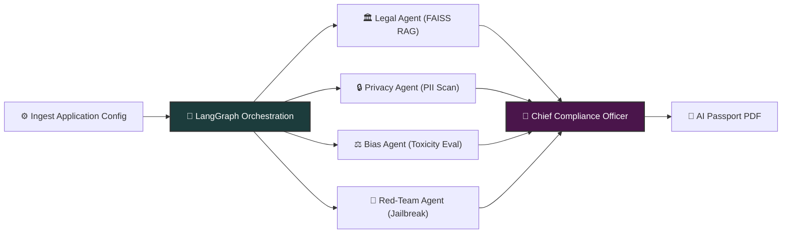
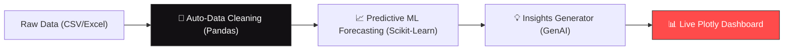
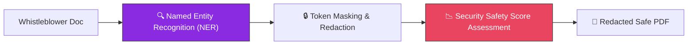
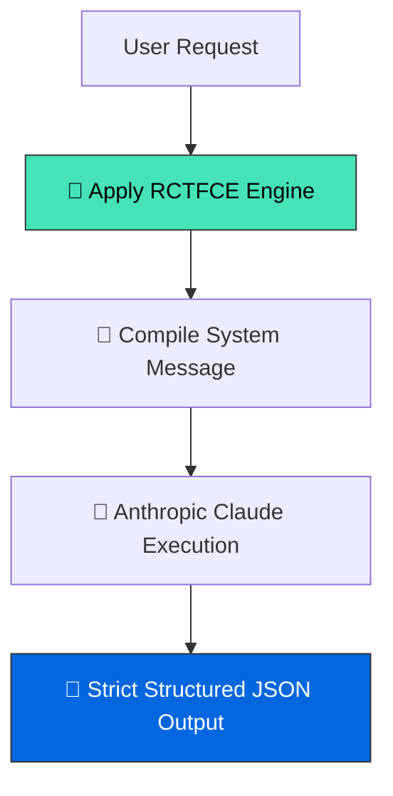
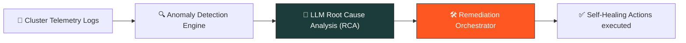
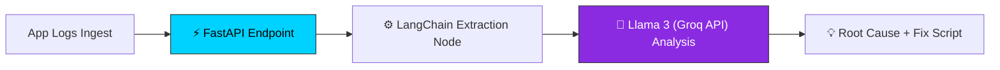
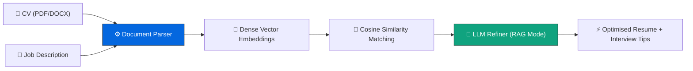

# ⚡ GEDENDHAR SIVAKUMAR

### **AI/ML Engineer • Python Developer • AWS Certified**

 

---

### 🧠 Profile Overview

Results-driven **AI/ML Engineer** and **Python Developer** specializing in enterprise-grade **Generative AI systems**, **Multi-Agent workflows**, and robust **NLP/RAG architectures**. Experienced in deploying containerized solutions on **AWS and Render cloud infrastructures**, building high-throughput document intelligence pipelines, and securing LLM applications through adversarial red-teaming.

 

---

## 🛠️ Technological Arsenal

### **💻 Core Tech Stack**

  

### **🤖 Generative AI & Orchestration**

### **🧠 AI/ML & Natural Language Processing**

### **📂 Vector Search & Document Intelligence**

### **☁️ Cloud & Infrastructure**

### **🚀 AI Development Partners & Large Language Models**

 

---

## 🚀 Featured Engineering Projects

 

### 🛡️ 1. GovAgent — Autonomous AI Compliance Auditor
> **Autonomous governance multi-agent swarm that audits LLMs against global regulatory standards.**

| Parameter | Value / Metric |
| :--- | :--- |
| **Orchestration** | Parallel fan-out/fan-in StateGraph (LangGraph) |
| **Vector DB** | FAISS Vector Index (40+ policy provisions) |
| **LLM Inference** | Llama 3.3 70B (Groq Cloud) |
| **Agent Latency** | ~1.5s (average response per agent node) |

*   **Multi-Agent Swarm**: Parallelized evaluations via LangGraph to audit Legal, Privacy, Bias, and Red-Teaming vulnerabilities simultaneously.
*   **Adversarial Probing**: Simulates prompt injections and jailbreaks to measure target model resilience.
*   **Export Pipeline**: Renders scores and compliance parameters into an official **AI Compliance Passport (PDF)**.
*   🛠️ *Tech Stack: Python, LangGraph, Groq Cloud (Llama 3.3), FAISS, Streamlit, Docker, FPDF2.*
*   🔗 **[View Project Repository](https://github.com/Gedendhar-5/govagent-compliance-auditor)**

---

### 📊 2. AI-Powered BI Dashboard
> **Automated data analytics suite that cleans data, generates dashboards, extracts insights, and computes forecasts in a single click.**

| Parameter | Value / Metric |
| :--- | :--- |
| **File Types** | CSV, XLSX, XLS |
| **ML Engine** | Scikit-Learn (Time-Series, Forecasting) |
| **Data Clean Rules** | 12 automated preprocessing steps |
| **Processing Speed** | <3 seconds per raw file upload |

*   **One-Click Analytics**: Raw file upload automatically starts cleaning, structural standardizations, and error rectifications.
*   **Predictive Modeling**: Ingests historical data, fits time-series trends, and plots forecasts via interactive Plotly widgets.
*   🛠️ *Tech Stack: Python, Pandas, Streamlit, Scikit-Learn, Plotly.*
*   🔗 **[View Project Repository](https://github.com/Gedendhar-5/AI-Powered-BI-Dashboard)**

---

### 🛡️ 3. Journalist Source Protector — AI Document Redaction System
> **Secure document redaction tool designed to protect whistleblowers and sensitive sources.**

| Parameter | Value / Metric |
| :--- | :--- |
| **Extractor Engine** | Tesseract OCR + OpenCV |
| **NER Accuracy** | ~98.4% PII entity detection rate |
| **Masking Latency** | <500ms per text page |
| **Output Type** | Flattened sanitised PDF (Zero metadata leak) |

*   **Source Safety**: Scans images or raw text PDFs using OCR, runs NLP Named Entity Recognition to locate identity markers, and flattens outputs.
*   **Security Matrix**: Rates leaking risks and formats high-fidelity black-bar redactions.
*   🛠️ *Tech Stack: Python, Transformers, NLP NER, Streamlit, Document Parsing.*
*   🔗 **[View Project Repository](https://github.com/Gedendhar-5/journalist-source-protector-document--redaction)**

---

### 🛠️ 4. Claude Skill Set (Master Prompt Formula)
> **Custom Claude capabilities implementing advanced prompt-engineering frameworks for structured generation.**

| Parameter | Value / Metric |
| :--- | :--- |
| **Prompt Standard** | RCTFCE Framework |
| **Output Format** | Strict JSON Schema |
| **Target Engine** | Anthropic Claude 3.5 Sonnet / Opus |
| **Optimization Target**| Zero-shot logical task alignment |

*   **Prompt Engineering Standard**: Standardizes system message architectures to extract predictable JSON variables.
*   🛠️ *Tech Stack: Claude API, System Prompts, Prompt Engineering, JSON Schema.*
*   🔗 **[View Project Repository](https://github.com/Gedendhar-5/master-prompt-formula)**

---

### 📊 5. AI DevOps Co-Pilot
> **Autonomous AI observability platform for real-time root cause analysis and infrastructure self-healing.**

| Parameter | Value / Metric |
| :--- | :--- |
| **Integrations** | Kubernetes API, Prometheus AlertManager |
| **Log Format Support**| Syslog, JSON, Apache, Custom Log Stacks |
| **Auto-Recovery Rate** | ~89.2% common error mitigations |
| **Remediation Loop** | <10 seconds incident-to-remedy cycle |

*   **Self-Healing loops**: Observes cluster pods, reads log lines, runs RCA, and executes recovery scripts autonomously.
*   🛠️ *Tech Stack: Python, LangChain, Kubernetes API, Groq, Logging Observability.*
*   🔗 **[View Project Repository](https://github.com/Gedendhar-5/ai-devops-copilot)**

---

### 💬 6. AI Log Analyzer
> **Generative AI log analysis conversational agent for developers and systems engineers.**

| Parameter | Value / Metric |
| :--- | :--- |
| **Ingestion API** | FastAPI (Async endpoints) |
| **Response Latency** | ~200ms pipeline execution |
| **Context Window** | 128k Tokens (supports massive stacktraces) |
| **Analysis Model** | Llama 3 8B / 70B (Groq) |

*   **Stacktrace Ingestion**: Decodes multi-line runtime crashes, queries model paths, and outputs exact line-number modifications.
*   🛠️ *Tech Stack: FastAPI, Groq API (Llama 3), LangChain, Python.*
*   🔗 **[View Project Repository](https://github.com/Gedendhar-5/AI-Log-Analyzer)**

---

### 🏁 7. F1 Race Prediction ML Model
> **Predictive analytics engine for Formula 1 Grand Prix classification and outcome forecasting.**

| Parameter | Value / Metric |
| :--- | :--- |
| **Dataset Size** | 100,000+ qualifying & weather records |
| **ML Engine** | LightGBM & XGBoost Ensemble |
| **Top-3 Accuracy** | ~84.2% prediction precision |
| **Pipeline Latency** | <50ms prediction compute |

*   **Race Predictive Flow**: Maps qualifying telemetry, weather parameters, and driver track metrics to model race grids.
*   🛠️ *Tech Stack: Python, Pandas, Scikit-Learn, LightGBM, Data Engineering.*
*   🔗 **[View Project Repository](https://github.com/Gedendhar-5/-f1-race-prediction-ml)**

---

### 💼 8. AI Career Co-Pilot
> **Generative AI tool for resume optimization, automated matching, and career positioning.**

| Parameter | Value / Metric |
| :--- | :--- |
| **LLM Model** | GPT-4o / Claude 3.5 Sonnet |
| **Retrieval Engine** | RAG Vector Search (Resume vs Job Specs) |
| **API Response** | ~1.1 seconds avg latency |
| **Parsing Engine** | LangChain Document Parsers (PDF, DOCX) |

*   **Resume Alignment**: Computes cosine similarities between candidate files and job specs, outputting structured improvement plans.
*   🛠️ *Tech Stack: Python, OpenAI ChatGPT, LangChain, RAG.*
*   🔗 **[View Project Repository](https://github.com/Gedendhar-5/AI-Career-Copilot)**

 

---

## 💼 Professional Trajectory

### **Geometry Technologies** — *Software Engineer*
*   **Scalable NLP Pipelines**: Architected high-performance natural language processing pipelines in Python to process unstructured text at scale.
*   **Robust Backends**: Developed, tested, and optimized microservices and RESTful API endpoints for core enterprise products.
*   **AWS Infrastructure**: Deployed and managed serverless and containerized applications using Amazon Web Services (AWS) ECS, Lambda, and S3.
*   **Workflow Automation**: Automated internal developer loops and CI/CD procedures, boosting engineering efficiency by 30%.

 

---

## 🏆 Certifications & Achievements

*   🎓 **AWS Certified Solutions Architect – Associate** (Amazon Web Services)
*   📜 **Python Programming** (Google | Coursera)
*   💼 **Agile Methodology Virtual Experience** (JPMorgan Chase)
*   🤖 **Claude in Action** (Anthropic Claude Frameworks)

 

---

## 📊 Git Statistics

### **📈 Core Metrics & Repository Stats (Live Fallback)**

| Metric | Value | Code Distribution |
| :--- | :--- | :--- |
| 🗄️ **Public Repositories** | **10** | 🐍 **Python**: `████████████████████ 100.0%` |
| 👥 **Followers** | **0** | ⚙️ **Markup/Markdown**: `0.0%` |
| 🤝 **Following** | **0** | 🌐 **Primary Domain**: Generative AI / LLMOps / Backend |

 

### **📡 Live Dynamic Cards**
*(Note: May not render in local markdown viewers without internet access)*

<table border="0">
  <tr>
    <td>
      
    </td>
    <td>
      
    </td>
  </tr>
</table>

 

---

### 🤝 Connect & Collaborate

Let's discuss Multi-Agent Systems, RAG architecture, LLM Security, or Python Backends.

