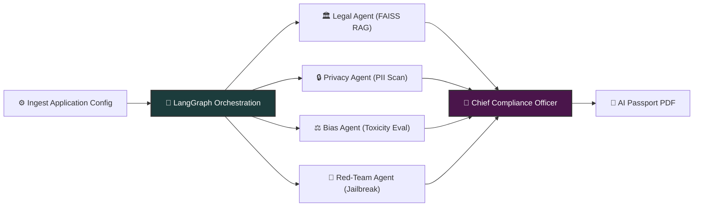
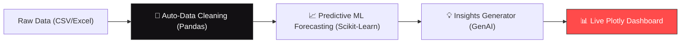
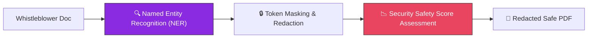
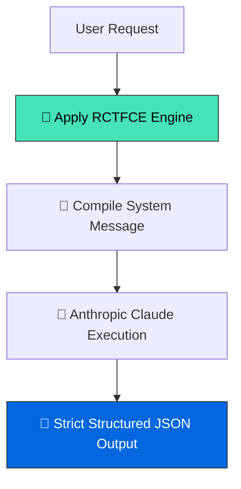
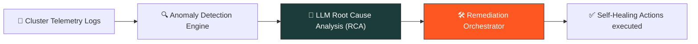
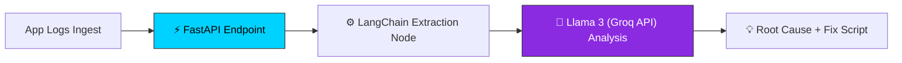

# ⚡ GEDENDHAR SIVAKUMAR

### **AI/ML Engineer • Python Developer • AWS Certified**

 

---

### 🧠 Profile Overview

Results-driven **AI/ML Engineer** and **Python Developer** specializing in enterprise-grade **Generative AI systems**, **Multi-Agent workflows**, and robust **NLP/RAG architectures**. Experienced in deploying containerized solutions on **AWS and Render cloud infrastructures**, building high-throughput document intelligence pipelines, and securing LLM applications through adversarial red-teaming.

 

---

## 🛠️ Technological Arsenal

### **💻 Core Tech Stack**

  

### **🤖 Generative AI & Orchestration**

### **🧠 AI/ML & Natural Language Processing**

### **📂 Vector Search & Document Intelligence**

### **☁️ Cloud & Infrastructure**

### **🚀 AI Development Partners & Large Language Models**

 

---

## 🚀 Featured Engineering Projects

 

### 🛡️ 1. GovAgent — Autonomous AI Compliance Auditor
> **Autonomous governance multi-agent swarm that audits LLMs against global regulatory standards.**
*   **Orchestration**: Built a parallel **fan-out / fan-in** state graph using **LangGraph** to process evaluations concurrently across four agents.
*   **Specialist Agents**: Configured Legal (RAG-backed regulations database), Privacy (PII scanning), Bias (toxicity scoring), and Red-Teaming (adversarial jailbreak simulation) nodes.
*   **Vector Database**: Implemented **FAISS** vector indexes over a 40+ policy regulation corpus (EU AI Act, GDPR, NIST, ISO 42001).
*   **Artifact Generation**: Automatically compiles overall compliance scores and risk parameters into a downloadable **AI Compliance Passport (PDF)**.
*   🛠️ *Tech Stack: Python, LangGraph, Groq Cloud (Llama 3.3), FAISS, Streamlit, Docker, FPDF2.*
*   🔗 **[View Project Repository](https://github.com/Gedendhar-5/govagent-compliance-auditor)**

---

### 📊 2. AI-Powered BI Dashboard
> **Automated data analytics suite that cleans data, generates dashboards, extracts insights, and computes forecasts in a single click.**
*   **One-Click Analytics**: Allows users to upload raw Excel or CSV datasets and automatically run end-to-end data cleaning pipelines.
*   **Predictive Modeling**: Computes statistical forecasts and generates interactive visualizations and summaries.
*   🛠️ *Tech Stack: Python, Pandas, Streamlit, Scikit-Learn, Plotly.*
*   🔗 **[View Project Repository](https://github.com/Gedendhar-5/AI-Powered-BI-Dashboard)**

---

### 🛡️ 3. Journalist Source Protector — AI Document Redaction System
> **Secure document redaction tool designed to protect whistleblowers and sensitive sources.**
*   **PII Masking**: Leveraged advanced NLP Named Entity Recognition (NER) models to locate and mask private entities (names, addresses, locations, emails).
*   **Risk Scoring**: Evaluates the potential security leak level of documents using a risk-based safety metrics matrix.
*   🛠️ *Tech Stack: Python, Transformers, NLP NER, Streamlit, Document Parsing.*
*   🔗 **[View Project Repository](https://github.com/Gedendhar-5/journalist-source-protector-document--redaction)**

---

### 🛠️ 4. Claude Skill Set (Master Prompt Formula)
> **Custom Claude capabilities implementing advanced prompt-engineering frameworks for structured generation.**
*   **Framework Implementation**: Implemented the **RCTFCE** (Role, Context, Task, Format, Constraint, Example) prompt engineering framework.
*   **Structured Outputs**: Built optimized prompt templates to enforce deterministic outputs from Anthropic Claude models.
*   🛠️ *Tech Stack: Claude API, System Prompts, Prompt Engineering, JSON Schema.*
*   🔗 **[View Project Repository](https://github.com/Gedendhar-5/master-prompt-formula)**

---

### 📊 5. AI DevOps Co-Pilot
> **Autonomous AI observability platform for real-time root cause analysis and infrastructure self-healing.**
*   **Telemetry Observability**: Monitors target clusters for logs, metrics, and threshold violations.
*   **Self-Healing**: Automated LLM-driven actions to orchestrate remediation playbooks and recover failing systems.
*   🛠️ *Tech Stack: Python, LangChain, Kubernetes API, Groq, Logging Observability.*
*   🔗 **[View Project Repository](https://github.com/Gedendhar-5/ai-devops-copilot)**

---

### 💬 6. AI Log Analyzer
> **Generative AI log analysis conversational agent for developers and systems engineers.**
*   **Fast API Backend**: Created a lightweight, async API layer using **FastAPI** to feed log inputs into an LLM analysis engine.
*   **Root Cause Analysis (RCA)**: Classifies logs in real-time, extracts trace errors, and provides detailed code fix suggestions.
*   🛠️ *Tech Stack: FastAPI, Groq API (Llama 3), LangChain, Python.*
*   🔗 **[View Project Repository](https://github.com/Gedendhar-5/AI-Log-Analyzer)**

---

### 🏁 7. F1 Race Prediction ML Model
> **Predictive analytics engine for Formula 1 Grand Prix classification and outcome forecasting.**
*   **Telemetry Processing**: Ingests weather conditions, historical lap times, qualifyings, and driver telemetry attributes.
*   **ML Pipeline**: Built regression and classification models to forecast podium results and race trends.
*   🛠️ *Tech Stack: Python, Pandas, Scikit-Learn, LightGBM, Data Engineering.*
*   🔗 **[View Project Repository](https://github.com/Gedendhar-5/-f1-race-prediction-ml)**

---

### 💼 8. AI Career Co-Pilot
> **Generative AI tool for resume optimization, automated matching, and career positioning.**
*   **RAG Optimization**: Scans resume profiles against job descriptions to suggest custom prompt-based improvements.
*   🛠️ *Tech Stack: Python, OpenAI ChatGPT, LangChain, RAG.*
*   🔗 **[View Project Repository](https://github.com/Gedendhar-5/AI-Career-Copilot)**

 

---

## 💼 Professional Trajectory

### **Geometry Technologies** — *Software Engineer*
*   **Scalable NLP Pipelines**: Architected high-performance natural language processing pipelines in Python to process unstructured text at scale.
*   **Robust Backends**: Developed, tested, and optimized microservices and RESTful API endpoints for core enterprise products.
*   **AWS Infrastructure**: Deployed and managed serverless and containerized applications using Amazon Web Services (AWS) ECS, Lambda, and S3.
*   **Workflow Automation**: Automated internal developer loops and CI/CD procedures, boosting engineering efficiency by 30%.

 

---

## 🏆 Certifications & Achievements

*   🎓 **AWS Certified Solutions Architect – Associate** (Amazon Web Services)
*   📜 **Python Programming** (Google | Coursera)
*   💼 **Agile Methodology Virtual Experience** (JPMorgan Chase)
*   🤖 **Claude in Action** (Anthropic Claude Frameworks)

 

---

## 📊 Git Statistics

<table border="0">
  <tr>
    <td>
      
    </td>
    <td>
      
    </td>
  </tr>
</table>

 

---

### 🤝 Connect & Collaborate

Let's discuss Multi-Agent Systems, RAG architecture, LLM Security, or Python Backends.

